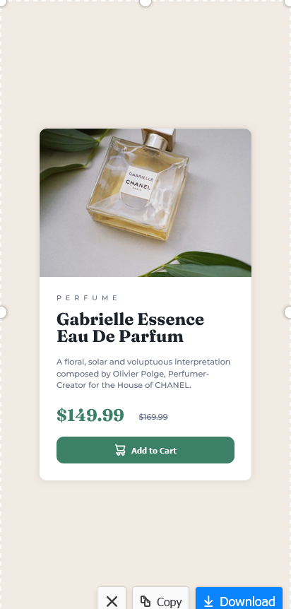

# Frontend Mentor - Product preview card component solution

This is a solution to the [Product preview card component challenge on Frontend Mentor](https://www.frontendmentor.io/challenges/product-preview-card-component-GO7UmttRfa).

## Table of contents

- [Overview](#overview)
  - [The challenge](#the-challenge)
  - [Screenshot](#screenshot)
  - [Links](#links)
- [My process](#my-process)
  - [Built with](#built-with)
  - [What I learned](#what-i-learned)
- [Author](#author)

## Overview

### The challenge

Users should be able to:

- View the optimal layout depending on their device's screen size
- See hover and focus states for interactive elements

### Screenshot

### Links

- Solution URL: [github](https://github.com/mihai2537/Product-preview-card-component)
- Live Site URL: [live-site](https://mihai2537.github.io/Product-preview-card-component/)

## My process

### Built with

- Semantic HTML5 markup
- CSS custom properties
- Flexbox
- Desktop-first workflow
- [Typescale](https://typescale.com/) - usefull tool for typography sizes system
- [TintsAndShadesGenerator](https://maketintsandshades.com) - usefull tool for generating tints and shades for button hoover effect

### What I learned

- images have some space at the bottom because this is how inline elements behave. They need some reserved space at the bottom for the "descenders" we find on letters. (example [here](https://stackoverflow.com/questions/5804256/image-inside-div-has-extra-space-below-the-image))
- a neat trick for changing images based on viewport size is to use html "picture" tag

## Author

- Website - [Mihai](https://mihai2537.github.io/Product-preview-card-component/)
